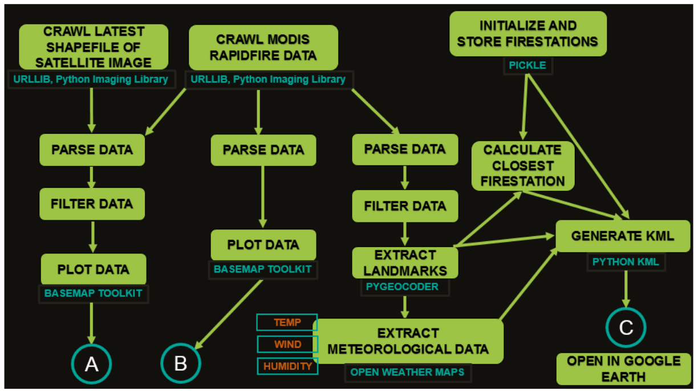
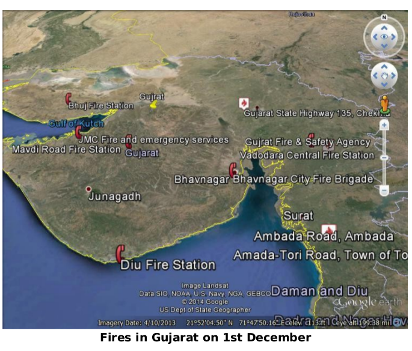
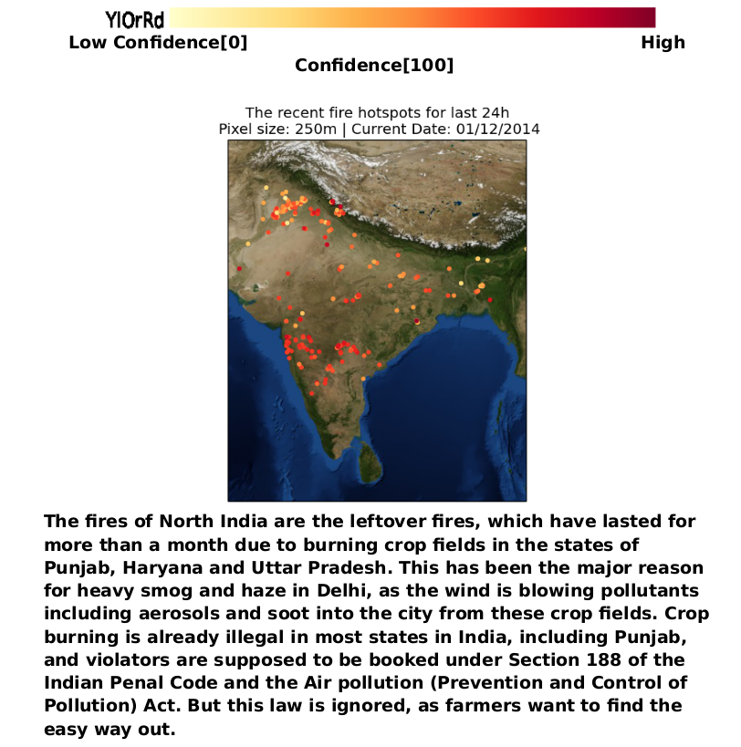

# Real-Time-Google-Earth-Modis-Mapping

Python Scripts to Crawl and Parse Realtime MODIS FIRMS Spectroradimeter Data from NASA.gov and Plot it on Google Earth
The app makes use of MODIS (The Moderate Resolution Imaging Spectroradiometer) aboard NASA’s Aqua and Terra satellites, which
orbit the Earth sending back high resolution images and spectroradiometer readings, which are made publicly available in
their website: https://earthdata.nasa.gov

An extention to: https://blog.christianperone.com/2009/02/python-acessing-near-real-time-modis-images-and-fire-data-from-nasas-aqua-and-terra-satellites/
=======

## Features
The scripts perform these basic functions:
<ol>
<li> Crawling latest satellite images and their metadata from NASA
<li> Crawling FIRMS (Fire Information For Resource Management System) Shapefiles of active fire hotspots
<li> Parsing these shapefiles and extracting essential parameters
<li>  Plotting the fire hotspots on the map in the basis of fire confidence intervals
</ol>
Using this basic framework, the app runs in three modes, each
performing different functions and having various features. The
internal working of the application is represented by the flowchart:

For further details, see the attached 
=======

##Results

=======

## Development

This repository is no longer maintained. Contributions are welcome!

=======

## License
MIT © [Samiran Roy](https://www.cse.iitb.ac.in/~samiranroy/)

